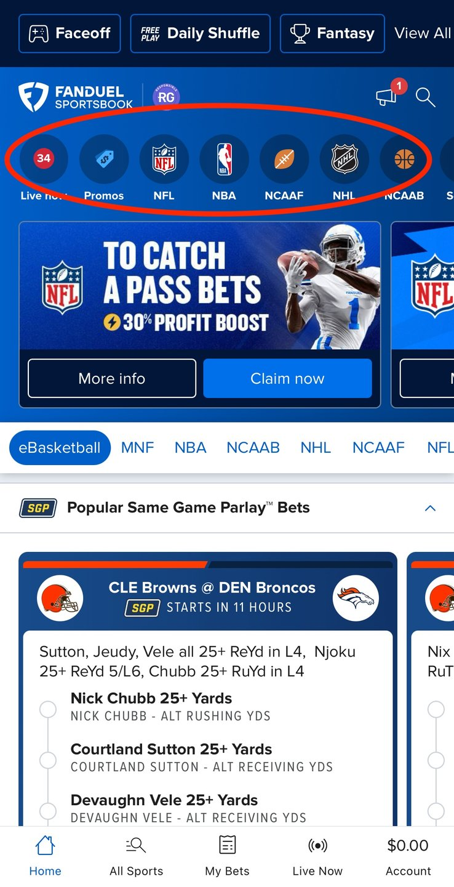

# Implementation instructions

_A guide on how to implement tracking for the generated Event Specifications._

**Table of contents:**
- [sports_bet](#sports-bet)
- [pop_nav_click](#pop-nav-click)
- [pop_nav_initial_load](#pop-nav-initial-load)
- [pop_nav_scroll](#pop-nav-scroll)

## [sports_bet](https://console.snowplowanalytics.com/8c1adb92-40c6-4974-84e2-7868dad3a142/data-products/9aa8aeb2-4299-4054-9ff2-f177040bebf6/event-specifications/34315b63-46a9-4dfd-b559-8b6c0f808fc9)

|       |  |
| ----------- | ----------- |  
| **Id** | 34315b63-46a9-4dfd-b559-8b6c0f808fc9 |
| **Version** | 3 |
| **Data Product Id** | 9aa8aeb2-4299-4054-9ff2-f177040bebf6 | 
| **Source Application/s** | Sportsbook iOS |
| **Event Data Structure** | place_bet/1-0-0 |
| **Entity Data Structures** |  |
| **Code** | [Link](./snowplow.swift#L385) |

### Implementation Instructions for place_bet event properties

#### Property Rules
|    Name   | Required  | Description |  Exact value(s) expected |
| ----------- | ----------- |  ----------- |  ----------- |  
type | ✅ | The type of bet being placed should be "sports" | `sports`
amount | ✅ | The amount of the bet | -

### Trigger 

#### Screenshot
_N/A_

#### In which application(s) does this trigger apply?

`sportsbook_ios` 

#### The URL of the page on which this event specification triggers:

_N/A_

#### Notes

When the user clicks the "bet life savings" button

## [pop_nav_click](https://console.snowplowanalytics.com/8c1adb92-40c6-4974-84e2-7868dad3a142/data-products/9aa8aeb2-4299-4054-9ff2-f177040bebf6/event-specifications/8169f58a-8233-43f2-b5c2-df56fce03bb6)

|       |  |
| ----------- | ----------- |  
| **Id** | 8169f58a-8233-43f2-b5c2-df56fce03bb6 |
| **Version** | 4 |
| **Data Product Id** | 9aa8aeb2-4299-4054-9ff2-f177040bebf6 | 
| **Source Application/s** | Sportsbook iOS |
| **Event Data Structure** | banner_interaction/1-0-0 |
| **Entity Data Structures** | banner_element/1-0-0 |
| **Code** | [Link](./snowplow.swift#L433) |

### Implementation Instructions for banner_interaction event properties

#### Property Rules
|    Name   | Required  | Description |  Exact value(s) expected |
| ----------- | ----------- |  ----------- |  ----------- |  
banner_name | ✅ | When the user interacted with the banner | `pop_nav`
banner_action | ✅ | When the user interacted with the banner | `click`

#### Entity Cardinality Rules
|    Name   | Required  | Number of entities  |
| ----------- | ----------- |  ----------- |
banner_element | ✅ | Exactly `1`

### Trigger 

#### Screenshot

#### In which application(s) does this trigger apply?

`sportsbook_ios` ,`sportsbook_android` 

#### The URL of the page on which this event specification triggers:

_N/A_

#### Notes

When a user clicks on a pill in the "pop nav" carousel

## [pop_nav_initial_load](https://console.snowplowanalytics.com/8c1adb92-40c6-4974-84e2-7868dad3a142/data-products/9aa8aeb2-4299-4054-9ff2-f177040bebf6/event-specifications/b7d09847-9031-42b4-867e-a0ae7d5fecc6)

|       |  |
| ----------- | ----------- |  
| **Id** | b7d09847-9031-42b4-867e-a0ae7d5fecc6 |
| **Version** | 5 |
| **Data Product Id** | 9aa8aeb2-4299-4054-9ff2-f177040bebf6 | 
| **Source Application/s** | Sportsbook iOS |
| **Event Data Structure** | banner_interaction/1-0-0 |
| **Entity Data Structures** | banner_element/1-0-0 |
| **Code** | [Link](./snowplow.swift#L458) |

### Implementation Instructions for banner_interaction event properties

#### Property Rules
|    Name   | Required  | Description |  Exact value(s) expected |
| ----------- | ----------- |  ----------- |  ----------- |  
banner_name | ✅ | When the user interacted with the banner | `pop_nav`
banner_action | ✅ | When the user interacted with the banner | `initial_load`

#### Entity Cardinality Rules
|    Name   | Required  | Number of entities  |
| ----------- | ----------- |  ----------- |
banner_element | ✅ | At least `5`

### Trigger 

#### Screenshot

#### In which application(s) does this trigger apply?

`sportsbook_ios` ,`sportsbook_android` 

#### The URL of the page on which this event specification triggers:

_N/A_

#### Notes

When the carousel circled is first visible to the user

## [pop_nav_scroll](https://console.snowplowanalytics.com/8c1adb92-40c6-4974-84e2-7868dad3a142/data-products/9aa8aeb2-4299-4054-9ff2-f177040bebf6/event-specifications/6ddffe7a-e2e3-4022-bee0-7bb20e8335a1)

|       |  |
| ----------- | ----------- |  
| **Id** | 6ddffe7a-e2e3-4022-bee0-7bb20e8335a1 |
| **Version** | 4 |
| **Data Product Id** | 9aa8aeb2-4299-4054-9ff2-f177040bebf6 | 
| **Source Application/s** | Sportsbook iOS |
| **Event Data Structure** | banner_interaction/1-0-0 |
| **Entity Data Structures** | banner_element/1-0-0 |
| **Code** | [Link](./snowplow.swift#L408) |

### Implementation Instructions for banner_interaction event properties

#### Property Rules
|    Name   | Required  | Description |  Exact value(s) expected |
| ----------- | ----------- |  ----------- |  ----------- |  
banner_name | ✅ | When the user interacted with the banner | `pop_nav`
banner_action | ✅ | When the user interacted with the banner | `scroll`

#### Entity Cardinality Rules
|    Name   | Required  | Number of entities  |
| ----------- | ----------- |  ----------- |
banner_element | ✅ | At least `5`

### Trigger 

#### Screenshot

#### In which application(s) does this trigger apply?

`sportsbook_ios` ,`sportsbook_android` 

#### The URL of the page on which this event specification triggers:

_N/A_

#### Notes

When the user scrolls through the "pop nav" carousel to see more pills

